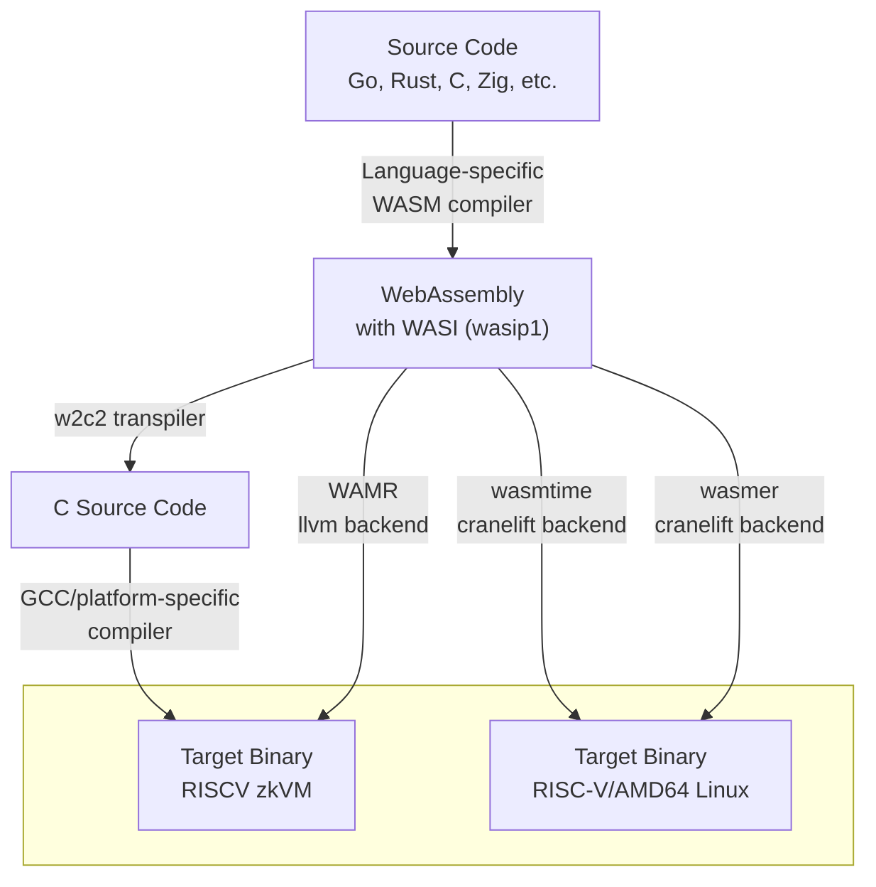

# WASRISC

The goal of this repository is to demostrate and benchmark different compilation methods of high level languages to RISCV64IM(target of RISCV zkVMs) via WASM-WASI as an intermediate step.

In this experiment we also want to know the impact on performance of using WASM-WASI as an intermediate step as compared to direct compilation from a high level language to RISCV64IM.

Note: Any language that compiles to WASM with WASI support(0.1) can use these pipelines but the main focus is on Go and Rust.

## Pipeline Overview

The common step in the pipelines is the compilation from a high level language to a WASM-WASI. WASM target is supported by compilers of most high level languages.

The transition from WASM to zkVM target can be achieved in many ways. 3 compilation methods were pursued in this experiment:
1. compilation of WASM to C source code with `w2c2` compiler and then compilation of C source code to the final target with `gcc` or a platform specific compiler
2. compilation of WASM to the final target with WAMR (LLVM backend)
3. compilation of WASM to Linux (either host or RISCV64) with `wasmtime` or `wasmer` (both utilizing `cranelift` for code generation)

For the 3rd approach Linux was the target because Linux was supported out of the box and porting to a bare-metal platform would be a significant effort. For the purpose of benchmarking of the Ethereum state transition function that discrepancy is not expected to matter much because of minimal OS interaction and lack of floating point operations usage in the code being benchmark.





## Prerequisites

The enviroment for running the benchmarks is dockerized. Docker includes:
- RISC-V GNU Toolchain with newlib (rv64ima)
- w2c2 WebAssembly-to-C transpiler
- qemu with with `libinsn` plugin
- WAMR
- wasmtime
- wasmer

> Running the docker script the first time, will take some time because it is rebuilding the RISCV gnu toolchain from source inside of Docker.

Regardless of using docker install on host:
- Rust
- Rust wasip1 target:
```
rustup target add wasm32-wasip1
```
- Rust RISCV target:
```
rustup target add riscv64gc-unknown-linux-gnu
```

## Quick Start

Run the `go_benchmark.sh` and `rust_benchmark.sh` scripts to compare different compilation methods for the Ethereum state transition function. These scripts:

1. Compile Rust and Go implementations using various methods
2. Execute the compiled binaries under QEMU with the `libinsn` plugin to count instructions
3. Save the instruction counts for each compilation method to `go_benchmark_results.txt` and `rust_benchmark_results.txt` (see "total insns" in those files)

See the scripts themselves for implementation details.

## Benchmark

Following benchmarks have been performed:
- `w2c2 -O0` - WASM is compiled to C with `w2c2`; then C sources are compiled with gcc with optimization "-O0" for Linux `rv64imad`
- `w2c2 optimized` - WASM is compiled to C with `w2c2`; then C sources are compiled with gcc with non zero optimization for Linux `rv64imad`
- `directly`:
  - for Rust: `cargo build --target riscv64gc-unknown-linux-gnu --release`
  - for Go: `GOOS=linux GOARCH=riscv64 go build`
- `wasmtime` - WASM is compiled with `wasmtime` using Cranelift code generation backend to a `riscv64gc` precompiled ".cwasm" file; the latter is then executed using the `wasmtime` runtime on Linux
- `wasmer (cranelift)` -  WASM is compiled with by `wasmer` using Cranelift code generation backend to a `riscv64gc` precompiled ".wasmu" file; the latter is then executed using the `wasmer` runtime on Linux
- `wamr -O0` - WASM is compiled by `wamr` using LLVM code generation backend with optimization -O0 for bare metal `riscv64ima`

Following critical benchmarks have not yet been performed because of issues in `wasmer` and `wamr`:
- `wasmer (llvm)` -  WASM is compiled with by `wasmer` using LLVM code generation backend to a `riscv64gc` precompiled ".wasmu" file; the latter is then executed using the `wasmer` runtime on Linux
- `wamr -O3` - WASM is compiled by `wamr` using LLVM code generation backend with optimization -O3 for bare metal `riscv64ima`

These issues are described in more detailed in "Issues" section.

## Benchmark results

|program|w2c2<br>-O0|w2c2<br>optimized|wasmtime|wasmer<br>(cranelift)|wasmer<br>(llvm)|WAMR<br>-O0|WAMR<br>-O3|directly|
|---|---|---|---|---|---|---|---|---|
|`reva-client-eth` (rust)|7,887,190,279|1,419,050,123<br>-O1|1,074,488,397|doesn't work|?|didn't check|?|388,564,723|
|`stateless`(go)|12,866,052,519|2,110,574,100<br>-O3|874,758,419|953,874,491|?|5,427,433,654|?|236,265,327|

## Analysis of the results

Please note that `reva-client-eth` and `stateless` numbers shall not be compared against each other. These two implementations are executed against a different block and with a different block serialization framework.

Unfortunatelly due to some issues we were not able to benchmark the most promising approaches: `wasmer (llvm)` and `wamr -O3`. The analysis is based only on available benchmark results.

Conclusions:
- not suprisingly the direct compilation method is the fastest
- for `w2c2` the optimizations used for gcc are critical giving 6x speedup compared to non-optimized "-O0" builds
- pipelines based on `cranelift` have the best performance
- the ratio of the number instructions instructions required to do the computation when program is compiled via `wasmtime` and directly is:
  - 2.8 for `reva-client-eth`
  - 3.7 for `stateless`
- from the above one can conclude that the quality of WASM generated by Go compiler is not much worse than the quality of WASM generated by Rust compiler
- `wamr -O0`is currently in between `w2c2` and `wasmtime`

### Size of binaries

```
$ ls -lah build/bin/
827K fibonacci.riscv.O0.elf
686K fibonacci.riscv.O3.elf
823K hello_world.riscv.O0.elf
682K hello_world.riscv.O3.elf
23M  reva-client-eth.riscv.O0.elf
19M  reva-client-eth.riscv.O1.elf
74M  stateless.amd64.O0.elf
28M  stateless.amd64.O1.elf
29M  stateless.amd64.O3.elf
67M  stateless.riscv.O0.elf
58M  stateless.riscv.O1.elf
64M  stateless.riscv.O3.elf
```

## Issues

### `wamr -O3` bug
Running WAMR with non-zero optimization levels on RISC-V currently fails with a relocation error. https://github.com/bytecodealliance/wasm-micro-runtime/issues/4765

### `wasmer (llvm)` bug

https://github.com/wasmerio/wasmer/issues/5954
https://github.com/wasmerio/wasmer/issues/5951

`wasmer` team's been actively working on fixing RISCV target.

### gcc bug

The `w2c2 optimized` compilation pipeline for `reva-client-eth` uses the `-O1` optimization level. Using higher optimization leads to non-terminating compilation. It was confirmed that it's a gcc bug. That conclusion was drawn by the following observations:
- clang is able to compile the same sources
- w2c2 was provided with `-f 100` option that results in splitting into many source files; then gcc was stuck at compilation of a single file with ~1000LOC

`reva-client-eth` compiled with `clang` with `-O3` optimization level requires 1.2e9 instructions to execute. That's not much less than when compiled with `gcc` with `-O1` that requires 1.4e9 instructions.

### linking problem

The `w2c2 optimized` compilation pipeline for `stateless` program won't link if the optimization level is non-zero. The error is:
```
guest.c:(.text.guestInitMemories+0x50): relocation truncated to fit: R_RISCV_JAL against `.L214'
collect2: error: ld returned 1 exit status
```

The culprit is a single huge function `guestInitMemories` that spans over 100,000 LOC in C as generated by w2c2 for `stateless`. GCC emits `R_RISCV_JAL` for intra-function branches which can refer to ±1MB PC relative. GCC has no fallback mechanism to automatically use AUIPC+JALR for out-of-range intra-function jumps when optimization creates the problem. More specifically, a flag `-fno-reorder-blocks` can be used to disable optimization that leads to large jumps. With that flag `stateless` can be build with `-O3` optimization level.

The issue with large intra-function jumps is not present on x86 because on that platform relative jumps can be 32-bit.

### Compilation times

For higher optimization levels (e.g. `-O3`) one can expect compilation times of `reva-client-eth` and `stateless` up to 60 minutes.

### Custom WASM Imports

You can call platform-specific functions from your WASM code using custom imports.

In Go, use `//go:wasmimport`:

```go
// examples/go/with_import/example.go
package main

import "fmt"

//go:wasmimport testmodule testfunc
//go:noescape
func testfunc(a, b uint32) uint32

func main() {
    result := testfunc(1, 2)
    fmt.Printf("testfunc(1, 2) = %d\n", result)
}
```

Implement the import in `platform/*/custom_imports.c`:
```c
// platform/amd64/custom_imports.c
U32 testmodule__testfunc(void* p, U32 a, U32 b) {
    printf("testfunc called with %u, %u\n", a, b);
    return a + b;
}
```

### Memory Limits

For embedded targets with limited memory, use `debug.SetMemoryLimit()`:
```go
import "runtime/debug"

func main() {
    debug.SetMemoryLimit(400 * (1 << 20)) // 400MB limit
    // ...
}
```

## License

MIT + Apache
