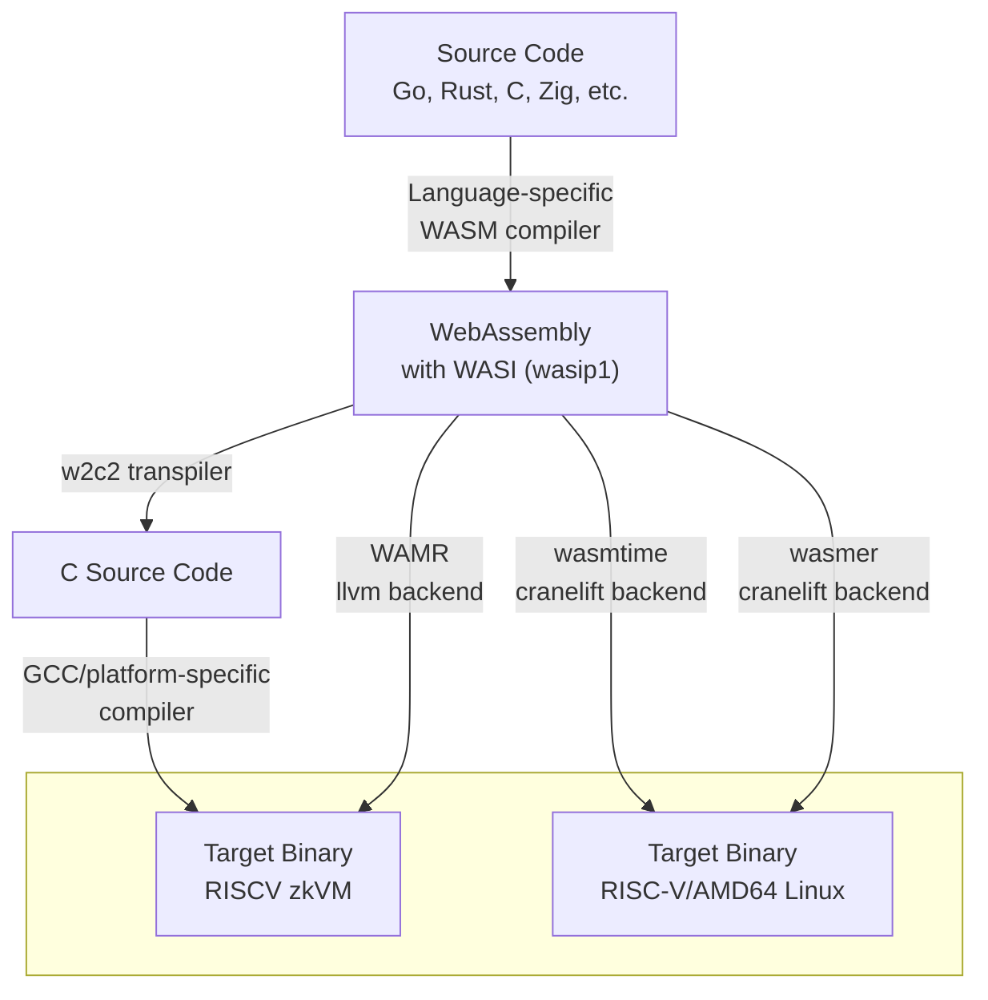

# WASRISC

This repository demonstrates and benchmarks different compilation methods for translating high-level languages to RISCV64IM (the target architecture for RISCV zkVMs) using WASM-WASI as an intermediate representation.

This experiment measures the performance impact of using WASM-WASI as an intermediate step compared to direct compilation from high-level languages to RISCV64IM.

**Note:** While any language that compiles to WASM with WASI support (0.1) can use these pipelines, this project focuses primarily on Go and Rust.

## Pipeline Overview

All pipelines share a common first step: compiling high-level source code to WASM-WASI. Most modern language compilers support WASM as a target.

The transition from WASM to the zkVM target can be achieved through multiple approaches. This experiment explores three compilation methods:

1. **w2c2 + GCC**: Transpile WASM to C source code using the `w2c2` compiler, then compile the C code to the final target using `gcc` or a platform-specific compiler
2. **WAMR (LLVM)**: Compile WASM directly to the final target using WAMR's LLVM backend
3. **wasmtime/wasmer (Cranelift)**: Compile WASM to Linux (either host or RISCV64) using `wasmtime` or `wasmer`, both of which use Cranelift for code generation

For the third approach, we targeted Linux because it's supported out of the box—porting to bare-metal would require significant additional effort. For benchmarking the Ethereum state transition function, this difference shouldn't significantly affect results due to minimal OS interaction and the absence of floating-point operations in the benchmark code.



## Prerequisites

The benchmark environment is dockerized and includes:
- RISC-V GNU Toolchain with newlib (rv64ima)
- w2c2 WebAssembly-to-C transpiler
- QEMU with `libinsn` plugin
- WAMR
- wasmtime
- wasmer

> **Note:** The first time you run the Docker script, it will take some time as it rebuilds the RISC-V GNU toolchain from source.

In addition to Docker, install the following on your host system:
- Rust
- Rust wasip1 target:
  ```bash
  rustup target add wasm32-wasip1
  ```
- Rust RISC-V target:
  ```bash
  rustup target add riscv64gc-unknown-linux-gnu
  ```

## Quick Start

Run the `go_benchmark.sh` and `rust_benchmark.sh` scripts to compare different compilation methods for the Ethereum state transition function. These scripts will:

1. Compile Rust and Go implementations using various methods
2. Execute the compiled binaries under QEMU with the `libinsn` plugin to count instructions
3. Save instruction counts for each compilation method to `go_benchmark_results.txt` and `rust_benchmark_results.txt` (see "total insns" in those files)

See the scripts for implementation details.

## Benchmark Configurations

The following benchmarks were performed:

- **w2c2 -O0**: WASM transpiled to C with `w2c2`, then compiled with GCC using `-O0` optimization for Linux `rv64imad`
- **w2c2 optimized**: WASM transpiled to C with `w2c2`, then compiled with GCC using higher optimization levels for Linux `rv64imad`
- **directly**:
  - Rust: `cargo build --target riscv64gc-unknown-linux-gnu --release`
  - Go: `GOOS=linux GOARCH=riscv64 go build`
- **wasmtime**: WASM compiled with `wasmtime` using Cranelift backend to a `riscv64gc` precompiled ".cwasm" file, then executed using the `wasmtime` runtime on Linux
- **wasmer (cranelift)**: WASM compiled with `wasmer` using Cranelift backend to a `riscv64gc` precompiled ".wasmu" file, then executed using the `wasmer` runtime on Linux
- **wamr -O0**: WASM compiled with `wamr` using LLVM backend with `-O0` optimization for bare-metal `riscv64ima`

The following critical benchmarks could not yet be performed due to issues in `wasmer` and `wamr`:

- **wasmer (llvm)**: WASM compiled with `wasmer` using LLVM backend to a `riscv64gc` precompiled ".wasmu" file, then executed using the `wasmer` runtime on Linux
- **wamr -O3**: WASM compiled with `wamr` using LLVM backend with `-O3` optimization for bare-metal `riscv64ima`

See the "Known Issues" section for details.

## Benchmark Results

| Program | w2c2<br>-O0 | w2c2<br>optimized | wasmtime | wasmer<br>(cranelift) | wasmer<br>(llvm) | WAMR<br>-O0 | WAMR<br>-O3 | directly |
|---|---|---|---|---|---|---|---|---|
| `reva-client-eth` (Rust) | 7,887,190,279 | 1,419,050,123<br>(-O1) | 1,074,488,397 | doesn't work | ? | didn't check | ? | 388,564,723 |
| `stateless` (Go) | 12,866,052,519 | 2,110,574,100<br>(-O3) | 874,758,419 | 953,874,491 | ? | 5,427,433,654 | ? | 236,265,327 |

## Analysis

**Important:** The `reva-client-eth` and `stateless` numbers should not be compared directly against each other, as these implementations execute against different blocks using different block serialization frameworks.

Unfortunately, we were unable to benchmark the most promising approaches (`wasmer (llvm)` and `wamr -O3`) due to outstanding issues. The following analysis is based on available results only.

### Key Findings

- **Direct compilation is fastest**: As expected, compiling directly to the target architecture provides the best performance
- **Optimization level is critical for w2c2**: Using GCC optimization flags provides a 6x speedup compared to unoptimized `-O0` builds
- **Cranelift-based pipelines perform best**: Among the WASM-based approaches, pipelines using Cranelift for code generation show the best performance
- **Performance overhead of WASM intermediate step**: The ratio of instructions required when compiling via `wasmtime` versus direct compilation is:
  - 2.8x for `reva-client-eth` (Rust)
  - 3.7x for `stateless` (Go)
- **WASM quality comparison**: The relatively similar overhead ratios suggest that Go's WASM compiler generates code quality comparable to Rust's WASM compiler
- **WAMR -O0 performance**: Currently falls between `w2c2` and `wasmtime` in terms of instruction count

### Binary Sizes

```
$ ls -lah build/bin/
827K fibonacci.riscv.O0.elf
686K fibonacci.riscv.O3.elf
823K hello_world.riscv.O0.elf
682K hello_world.riscv.O3.elf
23M  reva-client-eth.riscv.O0.elf
19M  reva-client-eth.riscv.O1.elf
74M  stateless.amd64.O0.elf
28M  stateless.amd64.O1.elf
29M  stateless.amd64.O3.elf
67M  stateless.riscv.O0.elf
58M  stateless.riscv.O1.elf
64M  stateless.riscv.O3.elf
```

## Known Issues

### WAMR -O3 Bug

Running WAMR with non-zero optimization levels on RISC-V currently fails with a relocation error.
Issue: https://github.com/bytecodealliance/wasm-micro-runtime/issues/4765

### Wasmer (LLVM) Bug

The wasmer team is actively working on fixing RISC-V target support.
Issues:
- https://github.com/wasmerio/wasmer/issues/5954
- https://github.com/wasmerio/wasmer/issues/5951

### GCC Bug

The `w2c2 optimized` pipeline for `reva-client-eth` uses the `-O1` optimization level. Higher optimization levels cause GCC to hang during compilation. This has been confirmed as a GCC bug based on the following observations:
- Clang successfully compiles the same sources
- When w2c2 is invoked with the `-f 100` option (which splits output into many source files), GCC hangs while compiling a single ~1000 LOC file

For reference, `reva-client-eth` compiled with Clang using `-O3` requires 1.2×10⁹ instructions to execute—not significantly fewer than when compiled with GCC using `-O1` (1.4×10⁹ instructions).

### Linking Problem

The `w2c2 optimized` pipeline for the `stateless` program fails to link when using non-zero optimization levels, producing the error:

```
guest.c:(.text.guestInitMemories+0x50): relocation truncated to fit: R_RISCV_JAL against `.L214'
collect2: error: ld returned 1 exit status
```

The issue stems from a single massive function `guestInitMemories` spanning over 100,000 lines of C code generated by w2c2 for `stateless`. GCC emits `R_RISCV_JAL` relocation for intra-function branches, which support only ±1MB PC-relative jumps. GCC lacks a fallback mechanism to automatically use AUIPC+JALR for out-of-range intra-function jumps when optimization creates this problem.

**Workaround:** Use the `-fno-reorder-blocks` flag to disable the optimization that creates large jumps. With this flag, `stateless` can be built with `-O3` optimization.

**Note:** This issue doesn't occur on x86 because that platform supports 32-bit relative jumps.

### Compilation Times

For higher optimization levels (e.g., `-O3`), expect compilation times of up to 60 minutes for `reva-client-eth` and `stateless`.

## Advanced Usage

### Custom WASM Imports

You can call platform-specific functions from your WASM code using custom imports.

In Go, use `//go:wasmimport`:

```go
// examples/go/with_import/example.go
package main

import "fmt"

//go:wasmimport testmodule testfunc
//go:noescape
func testfunc(a, b uint32) uint32

func main() {
    result := testfunc(1, 2)
    fmt.Printf("testfunc(1, 2) = %d\n", result)
}
```

Implement the import in `platform/*/custom_imports.c`:

```c
// platform/amd64/custom_imports.c
U32 testmodule__testfunc(void* p, U32 a, U32 b) {
    printf("testfunc called with %u, %u\n", a, b);
    return a + b;
}
```

### Memory Limits

For embedded targets with limited memory, use `debug.SetMemoryLimit()`:

```go
import "runtime/debug"

func main() {
    debug.SetMemoryLimit(400 * (1 << 20)) // 400MB limit
    // ...
}
```

## License

MIT + Apache