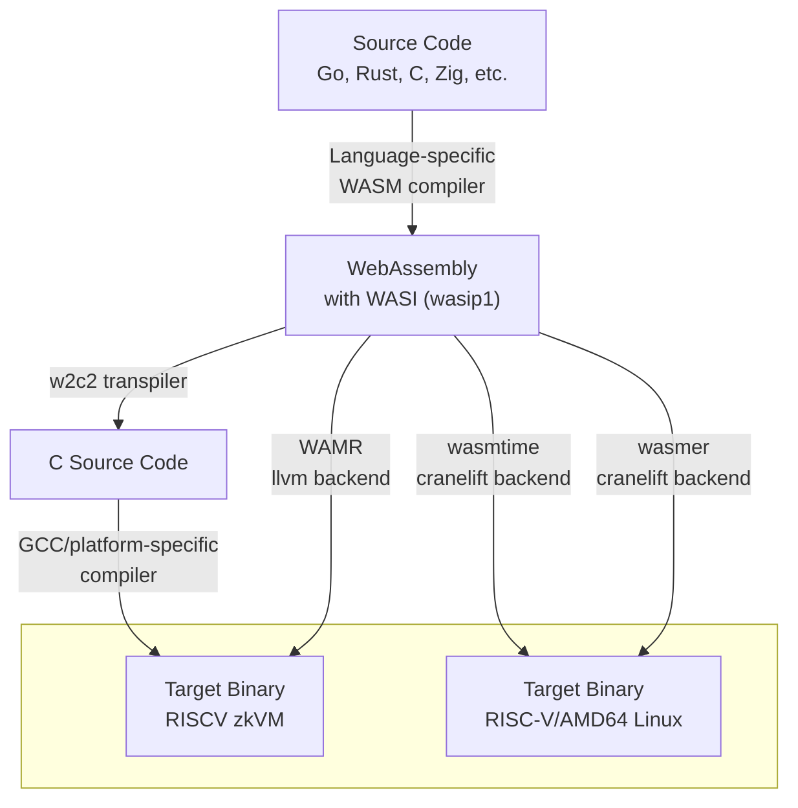

# WASRISC

This repository demonstrates and benchmarks different compilation methods for translating high-level languages to RISCV64IM (the target architecture for RISCV zkVMs) using WASM-WASI as an intermediate representation.

This experiment measures the performance impact of using WASM-WASI as an intermediate step compared to direct compilation from high-level languages to RISCV64IM.

**Note:** While any language that compiles to WASM with WASI support (0.1) can use these pipelines, this project focuses primarily on Go and Rust.

## Pipeline Overview

All pipelines share a common first step: compiling high-level source code to WASM-WASI. Most modern language compilers support WASM as a target.

The transition from WASM to the zkVM target can be achieved through multiple approaches. This experiment explores three compilation methods:

1. **w2c2 + GCC**: Transpile WASM to C source code using the `w2c2` compiler, then compile the C code to the final target using `gcc` or a platform-specific compiler
2. **WAMR (LLVM)**: Compile WASM directly to the final target using WAMR's LLVM backend
3. **wasmtime/wasmer (Cranelift)**: Compile WASM to Linux (either host or RISCV64) using `wasmtime` or `wasmer`, both of which use Cranelift for code generation

For the third approach, we targeted Linux because it's supported out of the box—porting to bare-metal would require significant additional effort. For benchmarking the Ethereum state transition function, this difference shouldn't significantly affect results due to minimal OS interaction and the absence of floating-point operations in the benchmark code.



## Prerequisites

The benchmark environment is dockerized and includes:
- RISC-V GNU Toolchain with newlib (rv64ima)
- w2c2 WebAssembly-to-C transpiler
- QEMU with `libinsn` plugin
- WAMR
- wasmtime
- wasmer

> **Note:** The first time you run the Docker script, it will take some time as it rebuilds the RISC-V GNU toolchain from source.

## Quick Start


Run the `./docker-shell.sh run_all_benchmarks_with_report.sh` script to compare different compilation methods for the Ethereum state transition function. These scripts will:

1. Compile Rust and Go implementations using various methods
2. Execute the compiled binaries under QEMU with the `libinsn` plugin to count instructions
3. Save instruction counts for each compilation method to `report.md` file

See the scripts for implementation details.

## Benchmark Configurations

The following benchmarks were performed:

- **w2c2 -O0**: WASM transpiled to C with `w2c2`, then compiled with GCC using `-O0` optimization for Linux `rv64imad`
- **w2c2 optimized**: WASM transpiled to C with `w2c2`, then compiled with GCC using higher optimization levels for Linux `rv64imad`
- **directly**:
  - Rust: `cargo build --target riscv64gc-unknown-linux-gnu --release`
  - Go: `GOOS=linux GOARCH=riscv64 go build`
- **wasmtime**: WASM compiled with `wasmtime` using Cranelift backend to a `riscv64gc` precompiled ".cwasm" file, then executed using the `wasmtime` runtime on Linux
- **wasmer (cranelift)**: WASM compiled with `wasmer` using Cranelift backend to a `riscv64gc` precompiled ".wasmu" file, then executed using the `wasmer` runtime on Linux
- **wamr -O0**: WASM compiled with `wamr` using LLVM backend with `-O0` optimization for bare-metal `riscv64ima`

The following critical benchmarks could not yet be performed due to issues in `wasmer` and `wamr`:

- **wasmer (llvm)**: WASM compiled with `wasmer` using LLVM backend to a `riscv64gc` precompiled ".wasmu" file, then executed using the `wasmer` runtime on Linux
- **wamr -O3**: WASM compiled with `wamr` using LLVM backend with `-O3` optimization for bare-metal `riscv64ima`

Since these critical benchmarks could not be performed on RISC-V, they were performed on AArch64 with the expectation that those results would allow us to extrapolate potential RISC-V performance.

See the "Known Issues" section for details.

## Benchmark Results on RISCV

| Program | w2c2<br>-O0 | w2c2<br>-O3 | wasmtime | wasmer<br>(cranelift) | wasmer<br>(llvm) | WAMR<br>-O0 | WAMR<br>-O3 | directly |
|---|---|---|---|---|---|---|---|---|
| `reva-client-eth` (Rust) | 4,543,397,058 | 1,337,696,305 | 1,074,488,397 | doesn't work | ? | didn't check | ? | 388,564,723 |
| `stateless` (Go) | 6,039,298,186 | 2,154,036,727 | 874,758,419 | 953,874,491 | ? | 3,526,934,350 | ? | 236,265,327 |

## Analysis

**Important:** The `reva-client-eth` and `stateless` numbers should not be compared directly against each other, as these implementations execute against different blocks using different block serialization frameworks.

Unfortunately, we were unable to benchmark the most promising approaches (`wasmer (llvm)` and `wamr -O3`) on RISCV due to outstanding issues. The following analysis is based on available results for RISCV only.

### Key Findings

- **Direct compilation is fastest**: As expected, compiling directly to the target architecture provides the best performance
- **Optimization level is critical for w2c2**: Using Clang optimization flags provides a 3-4x speedup compared to unoptimized `-O0` builds
- **Cranelift-based pipelines perform best**: Among the WASM-based approaches, pipelines using Cranelift for code generation show the best performance
- **Performance overhead of WASM intermediate step**: The ratio of instructions required when compiling via `wasmtime` versus direct compilation is:
  - 2.8x for `reva-client-eth` (Rust)
  - 3.7x for `stateless` (Go)
- **Effective performance comparison**: The relatively similar overhead ratios suggest that Go's WASM compiler generates code quality comparable to Rust's WASM compiler
- **WASM code quality**: Generally Rust's WASM output has a more optimized toolchain. Go's generated code currently produces a lot of `blocks` statements e.g. for loops in order to support context switches to Go routines. Especially in synthetic benchmarks such as Fibonacci without tail call optimization the runtime overhead can be huge. https://github.com/golang/go/issues/65440
- **WAMR -O0 performance**: Currently falls between `w2c2` and `wasmtime` in terms of instruction count

### Binary Sizes

```
$ ls -lah build/bin/
827K fibonacci.riscv.O0.elf
686K fibonacci.riscv.O3.elf
823K hello_world.riscv.O0.elf
682K hello_world.riscv.O3.elf
23M  reva-client-eth.riscv.O0.elf
19M  reva-client-eth.riscv.O1.elf
74M  stateless.amd64.O0.elf
28M  stateless.amd64.O1.elf
29M  stateless.amd64.O3.elf
67M  stateless.riscv.O0.elf
58M  stateless.riscv.O1.elf
64M  stateless.riscv.O3.elf
```

## Supplementary Benchmark Results on AARCH64

The benchmark was performed for stateless (Go) only. `WAMR -O3` targets dynamically-linked AArch64 Linux MUSL. To reduce the impact of dynamic linker overhead and WAMR runtime setup, multiple runs of the business logic were performed. In the following tables, all WAMR rows without a `--b-c=0` annotation used the `--bounds-checks=0` option during WAMR compilation. All other rows used the `--bounds-checks=1` option during WAMR compilation.

|pipeline<br>/<br>number of runs|wasmtime|wasmer<br>(cranelift)|wasmer<br>(llvm)|WAMR<br>-O3|directy|
|---|---|---|---|---|---|
|1x|659,241,636|663,867,152|626,137,758|990,892,303|166,611,730|
|1x|(same)|(same)|(same)|699,810,538<br><sup>--b-c=0<sup/>|(same)|
|10x|2,533,334,795|2,268,562,071|2,002,956,919|3,100,038,538|660,390,007|
|25x|5,686,210,736|4,978,224,909|4,338,984,157|6,674,027,814|1,477,959,349|
|50x|10,929,448,352|-|-|12,581,544,465|2,830,756,855|
|50x|(same)|-|-|8,338,818,655<br><sup>--b-c=0<sup/>|(same)|

The following table presents the ratio between the number of steps executed for a given compilation pipeline and the number of steps executed for a directly compiled program.

|pipeline<br>/<br>number of runs|wasmtime|wasmer<br>(cranelift)|wasmer<br>(llvm)|WAMR<br>-O3|directy|
|---|---|---|---|---|---|
|1x|3.95|3.98|3.75|5.94|1.0|
|1x|(same)|(same)|(same)|4.19<br><sup>--b-c=0<sup/>|(same)|
|10x|3.83|3.43|3.03|4.69|1.0|
|25x|3.84|3.36|2.93|4.51|1.0|
|50x|3.86|-|-|4.44|1.0|
|50x|(same)|-|-|2.94<br><sup>--b-c=0<sup/>|(same)|

The `--bounds-checks=0` option appears to be critical for WAMR performance. Only with this option can WAMR outperform Cranelift-based frameworks in some scenarios. For a single run, `wasmtime`, `wasmer (cranelift)`, `and wasmer (llvm)` show similar performance. Single-run results for WAMR are difficult to interpret due to overhead from dynamic linking and Linux WAMR runtime setup, which would not be present on a zkVM bare-metal platform. For compute-intensive programs (50x), WAMR appears to have an edge over other compilation pipelines. The best-performing WebAssembly approaches appear to be 3-4 times slower than direct compilation of the stateless Go program.

These results have not been taken into account in the "Analysis" section.

## Known Issues

### Wasmer (LLVM) Bug

The wasmer team is actively working on fixing RISC-V target support.
Issues:
- https://github.com/wasmerio/wasmer/issues/5954
- https://github.com/wasmerio/wasmer/issues/5951

### GCC Bug

The `w2c2 optimized` pipeline for `reva-client-eth` uses the `-O1` optimization level. Higher optimization levels cause GCC to hang during compilation. This has been confirmed as a GCC bug based on the following observations:
- Clang successfully compiles the same sources
- When w2c2 is invoked with the `-f 100` option (which splits output into many source files), GCC hangs while compiling a single ~1000 LOC file

For reference, `reva-client-eth` compiled with Clang using `-O3` requires 1.2×10⁹ instructions to execute—not significantly fewer than when compiled with GCC using `-O1` (1.4×10⁹ instructions).

### Linking Problem

In general PC-relative jumps can occur. When compiling w2c2 generated C-code it's especially challenging with gcc (see below). With Clang the issue appears significantly less often.

However during WAMR AOT platform runtime the issue also appears.

#### WAMR -O3 Bug

Running WAMR with non-zero optimization levels on RISC-V currently fails with a relocation error.
Issue: https://github.com/bytecodealliance/wasm-micro-runtime/issues/4765

#### GCC

The `w2c2 optimized` pipeline for the `stateless` program fails to link when using non-zero optimization levels, producing the error:

```
guest.c:(.text.guestInitMemories+0x50): relocation truncated to fit: R_RISCV_JAL against `.L214'
collect2: error: ld returned 1 exit status
```

The issue stems from a single massive function `guestInitMemories` spanning over 100,000 lines of C code generated by w2c2 for `stateless`. GCC emits `R_RISCV_JAL` relocation for intra-function branches, which support only ±1MB PC-relative jumps. GCC lacks a fallback mechanism to automatically use AUIPC+JALR for out-of-range intra-function jumps when optimization creates this problem.

**Workaround:** Use the `-fno-reorder-blocks` flag to disable the optimization that creates large jumps. With this flag, `stateless` can be built with `-O3` optimization.

**Note:** This issue doesn't occur on x86 because that platform supports 32-bit relative jumps.

### Compilation Times

Compilation times can be significant especially for w2c2. With gcc in combination with higher optimization levels (e.g., `-O3`), expect compilation times of up to 60 minutes for `reva-client-eth` and `stateless`. Using recent Clang version and parallel builds it's possible to improve the build time for `stateless` to 10-15 minutes though. `reva-client-eth` can even be built in 2-3 minutes.

https://github.com/llvm/llvm-project/issues/81440
https://github.com/llvm/llvm-project/commit/b06e736982a3568fe2bcea8688550f9e393b7450

## Advanced Usage

### Custom WASM Imports

You can call platform-specific functions from your WASM code using custom imports.

In Go, use `//go:wasmimport`:

```go
// examples/go/with_import/example.go
package main

import "fmt"

//go:wasmimport testmodule testfunc
//go:noescape
func testfunc(a, b uint32) uint32

func main() {
    result := testfunc(1, 2)
    fmt.Printf("testfunc(1, 2) = %d\n", result)
}
```

Implement the import in `platform/*/custom_imports.c`:

```c
// platform/amd64/custom_imports.c
U32 testmodule__testfunc(void* p, U32 a, U32 b) {
    printf("testfunc called with %u, %u\n", a, b);
    return a + b;
}
```

#### Dotnet

Dotnet imports are more complex than for Go, already because the build artifacts are wrapped as wasip2 components. In addition there are multiple FFI mechanisms.

The currently implemented strategy revolves around unmanaged code marked as `UnmanagedCallersOnly` because managed code is wrapped in a binary blob within the w2c2 output. In order to call the unmanaged code from managed code a function pointer ("`delegate`") is used.

Alternatively a fairly popular project is `componentize-dotnet`. However it is still experimental and various not trivial to upgrade dependencies marked as alpha. The glue mechanism used by the project is from `wit-bindgen`. While it can easily map even complex interface structures, unfortunately subtleties such as `unsigned` flags (`uint`) get dropped during the process. It would still be useful to evaluate the underlying mechanism.

https://github.com/bytecodealliance/componentize-dotnet
https://github.com/bytecodealliance/wit-bindgen

### Memory Limits

For embedded targets with limited memory, use `debug.SetMemoryLimit()`:

```go
import "runtime/debug"

func main() {
    debug.SetMemoryLimit(400 * (1 << 20)) // 400MB limit
    // ...
}
```

## License

MIT + Apache + BSD
