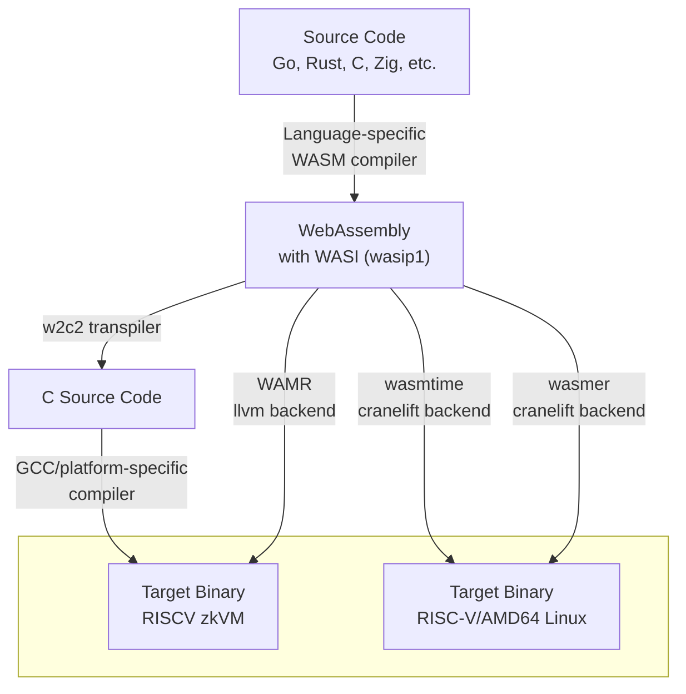

# WASRISC

The goal of this repository is to demostrate and benchmark different compilation methods of high level languages to RISCV64IM(target of RISCV zkVMs) via WASM-WASI as an intermediate step.

In this experiment we also want to know the impact on performance of using WASM-WASI as an intermediate step as compared to direct compilation from a high level language to RISCV64IM.

Note: Any language that compiles to WASM with WASI support(0.1) can use these pipelinelines but the main focus is on Go and Rust.

## Pipeline Overview

The common step is the compilation from a high level language to a WASM-WASI. WASM target is supported by compilers of most high level languages.

The transition from WASM to zkVM target can be achieved in many ways. 3 compilation methods were pursued in this experiment:
1. compilation of WASM to C source code with `w2c2` compiler and then compilation of C source code to the final target with `gcc` or a platform specific compiler
2. compilation of WASM to the final target with WAMR (LLVM backend)
3. compilation of WASM to Linux (either host or RISCV64) with `wasmtime` or `wasmer` (both utilizing `cranelift` for code generation)


For the 3rd approach Linux was the target because Linux was supported out of the box and porting to a bare-metal platform would be a significant effort. For the purpose of benchmarking of the Ethereum state transition function that discrepancy didn't matter because of minimal OS interaction and lack of floating point operations usage in the function being benchmark.





## Prerequisites

The enviroment for running the benchmarks is dockerized. Docker includes:
- RISC-V GNU Toolchain with newlib (rv64ima)
- w2c2 WebAssembly-to-C transpiler
- qemu with with `libinsn` plugin
- WAMR
- wasmtime
- wasmer

> Running the docker script the first time, will take some time because it is rebuilding the RISCV gnu toolchain from source inside of Docker.

Regardless of using docker install on host:
- Rust
- Rust wasip1 target:
```
rustup target add wasm32-wasip1
```
- Rust RISCV target:
```
rustup target add riscv64gc-unknown-linux-gnu
```

## Quick Start

### 1. Compile Your Source to WASM

For Go (included examples):

```bash
# Compile all Go examples to WASM
./examples/scripts/go2wasm.sh

# This creates WASM files in examples/build-wasm/go/
# For example: examples/build-wasm/go/println.wasm
```

### 2. Transpile WASM to C Package

```bash
./docker/wasm2c-package.sh examples/build-wasm/go/println.wasm build/c-packages/println/

# This creates:
#   build/c-packages/println/guest.c      - Generated C code
#   build/c-packages/println/guest.h      - Generated header
#   build/c-packages/println/w2c2_base.h  - w2c2 runtime
```

### 3. Compile to Target Platform

#### AMD64 (Native - for testing)
```bash
./platform/amd64/scripts/c2native-amd64.sh \
    build/c-packages/println \
    build/bin/println.amd64

# Run it
./build/bin/println.amd64
```

#### Zisk

```bash
./platform/zkvm/scripts/c2zkvm.sh \
    build/c-packages/println \
    build/bin/println.zkvm.elf

# Run in zkVM emulator (Need to install this separately)
ziskemu -e build/bin/println.zkvm.elf
```

#### QEMU RISC-V

```bash
./platform/riscv-qemu/scripts/c2riscv-qemu.sh \
    build/c-packages/println \
    build/bin/println.riscv.elf

# Run in QEMU
qemu-system-riscv64 -machine virt -bios none \
    -kernel build/bin/println.riscv.elf -nographic
```

#### QEMU RISC-V WAMR

Include OpenSBI BIOS (`-bios default` instead of `-bios none`) such that a shutdown function is present for improved benchmarking.

```bash
./platform/riscv-wamr-qemu/scripts/wasm2wamr-qemu.sh \
    examples/build-wasm/go/fibonacci.wasm \
    build/bin/fibonacci.wamr.elf

# Run in QEMU
./docker/docker-shell.sh qemu-system-riscv64 -machine virt -m 1024M \
    -kernel build/bin/fibonacci.wamr.elf -nographic -d plugin \
    -plugin /libinsn.so
```

## Examples

All examples below use Go, but the same principles apply to any language that compiles to WASM with WASI support.

### Simple Hello World

```go
// examples/go/println/example.go
package main

import "fmt"

func main() {
    fmt.Println("Hello world from golang")
}
```

### Custom WASM Imports

You can call platform-specific functions from your WASM code using custom imports.

In Go, use `//go:wasmimport`:

```go
// examples/go/with_import/example.go
package main

import "fmt"

//go:wasmimport testmodule testfunc
//go:noescape
func testfunc(a, b uint32) uint32

func main() {
    result := testfunc(1, 2)
    fmt.Printf("testfunc(1, 2) = %d\n", result)
}
```

Implement the import in `platform/*/custom_imports.c`:
```c
// platform/amd64/custom_imports.c
U32 testmodule__testfunc(void* p, U32 a, U32 b) {
    printf("testfunc called with %u, %u\n", a, b);
    return a + b;
}
```

## Memory Limits

For embedded targets with limited memory, use `debug.SetMemoryLimit()`:
```go
import "runtime/debug"

func main() {
    debug.SetMemoryLimit(400 * (1 << 20)) // 400MB limit
    // ...
}
```

# Benchmarks of Rust programs

The benchmark presents the number of instructions executed for a program compiled with various methods:
- "through WASM, -O0" was compiled by `./platform/riscv-qemu-user/scripts/c2riscv-qemu-user.sh` with `-O0` optimization level
- "through WASM, optimized" was compiled by `./platform/riscv-qemu-user/scripts/c2riscv-qemu-user.sh` with non-zero optimization level
- "directly" was compiled with `cargo build --target riscv64gc-unknown-linux-gnu --release`

The number of cycles was measured by using libinsn qemu plugin.


|program|w2c2<br>-O0|w2c2<br>optimized|wasmtime|wasmer<br>(cranelift)|directly|
|---|---|---|---|---|---|
|`reva-client-eth`|7,887,190,279|1,419,050,123<br>-O1|1,074,488,397|doesn't work|388,564,723|
|`fibonacci`|1,033,748|167,179<br>-O3|-|-|427,110|
|`hello-world`|42,819|20,634<br>-O3|-|-|211,591|

Please note that:
-  `./platform/riscv-qemu-user/scripts/c2riscv-qemu-user.sh` uses target `-march=rv64imad -march=rv64imad` whereas Rust direct compilation uses `rv64gc`.
- the programs could have been compiled for `qemu-system-riscv64` but direct compilation from Rust to baremetal would be more difficult.

These are not expected to affect the benchmark results in a significant way.

# Benchmarks of Go programs

Please note that:
-  `./platform/riscv-qemu-user/scripts/c2riscv-qemu-user.sh` uses target `-march=rv64imad -march=rv64imad` whereas Go direct compilation uses `rv64gc`.
- `wasmtime` targets rv64gc

|program|w2c2<br>-O0|w2c2<br>optimized|WAMR<br>-O0|wasmtime|wasmer (cranelift)|directly|
|---|---|---|---|---|---|---|
|`stateless`|12,866,052,519|2,110,574,100<br>-O3|5,427,433,654|874,758,419|953,874,491|236,265,327|

## Analysis of the results

### Rust results

Conclusions for `reva-client-eth`:
- the direct build is the fastest
- gcc optimization levels matter a lot
- unoptimized WASM is 20 times slower than the direct build
- `-O1` build is 3.6 times slower than the direct build
- `-O3` build improves on that a little bit - see the "gcc bug"

Conclusions for `fibonacci` and `hello-world`:
- surprisingly optimized WAS build is faster than the direct build

### Go results
`-O3` WASM approach is ~10 times slower than the direct compilation. `-O0` is 6 times slower than `-O3`. These gaps are significantly bigger than for the corresponding gaps for `reva-client-eth` Rust program.

Surprisingly WASM though `wasmtime` is faster than `w2c2`. `wasmtime` approach is ~3-4 times slower than the direct approach.

Unoptimized WAMR AOT is currently in between `w2c2` and wasmtime. Running WAMR with non-zero optimization levels on RISC-V currently fails with a relocation error. https://github.com/bytecodealliance/wasm-micro-runtime/issues/4765

### Other observations

`cranelift` (used by `wasmtime` and `wasmer`) proved to be the fastest runtime for Ethereum client programs written in Go and Rust. When running via `wasmtime`, execution required 2.7× more steps than native compilation for Rust and 4.0× for Go. This suggests the Go compiler may generate less efficient WASM bytecode than the Rust compiler, though the difference between the two ratios is significantly smaller than initially expected.

# Size of binaries

```
$ ls -lah build/bin/
827K fibonacci.riscv.O0.elf
686K fibonacci.riscv.O3.elf
823K hello_world.riscv.O0.elf
682K hello_world.riscv.O3.elf
23M  reva-client-eth.riscv.O0.elf
19M  reva-client-eth.riscv.O1.elf
74M  stateless.amd64.O0.elf
28M  stateless.amd64.O1.elf
29M  stateless.amd64.O3.elf
67M  stateless.riscv.O0.elf
58M  stateless.riscv.O1.elf
64M  stateless.riscv.O3.elf
```

# Issues

## gcc bug

The optimized `reva-client-eth` build uses the `-O1` optimization level. Using higher optimization leads to non-terminating compilation. It was confirmed that it's a gcc bug. That conclusion was drawn by the following observations:
- clang is able to compile the same sources
- w2c2 was provided with `-f 100` option that results in splitting into many source files; then gcc was stuck at compilation of a single file with ~1000LOC

`reva-client-eth` compiled with `clang` with `-O3` optimization level requires 1.2e9 instructions to execute. That's not much less than when compiled with `gcc` with `-O1` that requires 1.4e9 instructions.

## linking problem

The `stateless` Go program won't link if the optimization level is non-zero. The error is:
```
guest.c:(.text.guestInitMemories+0x50): relocation truncated to fit: R_RISCV_JAL against `.L214'
collect2: error: ld returned 1 exit status
```

The culprit is a single huge function `guestInitMemories` that spans over 100,000 LOC in C as generated by w2c2 for `stateless`. GCC emits `R_RISCV_JAL` for intra-function branches which can refer to ±1MB PC relative. GCC has no fallback mechanism to automatically use AUIPC+JALR for out-of-range intra-function jumps when optimization creates the problem. More specifically, a flag `-fno-reorder-blocks` can be used to disable optimization that leads to large jumps. With that flag `stateless` can be build with `-O3` optimization level.

The issue with large intra-function jumps is not present on x86 because on that platform relative jumps can be 32-bit.

## Compilation times

For higher optimization levels (e.g. `-O3`) one can expect compilation times of `reva-client-eth` and `stateless` up to 60 minutes.

## License

MIT + Apache
